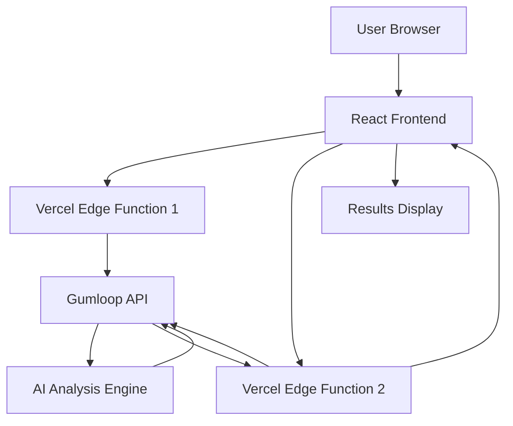

# Architecture Documentation - Dezygn Audit Tool

Detailed technical architecture and design decisions for the website audit tool.

## 🏗️ System Overview



## 🎯 Design Goals

1. **Performance**: Sub-2-minute analysis with real-time feedback
2. **Reliability**: Handle timeouts and failures gracefully
3. **Scalability**: Support concurrent users without degradation
4. **Maintainability**: Clear separation of concerns and logging
5. **Cost Efficiency**: Minimize API calls and function execution time

## 🏢 Architecture Layers

### 1. Frontend Layer (React)

**Location**: `/src/pages/AuditPage.tsx`

**Responsibilities**:
- User input validation and formatting
- Client-side polling coordination
- Real-time progress feedback
- Results visualization and interaction

**Key Patterns**:
- **State Management**: React hooks for local state
- **Error Boundaries**: Comprehensive error handling
- **Progressive Enhancement**: Works without JavaScript for basic validation

```typescript
// State Architecture
interface AuditState {
  websiteUrl: string;
  isAnalyzing: boolean;
  analysisComplete: boolean;
  analysisResults: AnalysisResults | null;
  error: string | null;
}
```

### 2. API Gateway Layer (Vercel Edge Functions)

**Location**: `/api/`

**Functions**:
1. `analyze-website.js` - Pipeline initiation
2. `poll-results.js` - Status polling and result retrieval

**Design Patterns**:
- **Separation of Concerns**: Each function has a single responsibility
- **Timeout Resilience**: Quick operations under 25-second Vercel limit
- **Comprehensive Logging**: Debug-friendly output at each step

```javascript
// Function Architecture
┌─────────────────┐    ┌──────────────────┐
│ analyze-website │    │   poll-results   │
├─────────────────┤    ├──────────────────┤
│ • Validate URL  │    │ • Check status   │
│ • Call Gumloop  │    │ • Parse outputs  │
│ • Return run_id │    │ • Return results │
└─────────────────┘    └──────────────────┘
```

### 3. External Services Layer

**Gumloop AI Platform**:
- **Pipeline API**: Webhook-based analysis initiation
- **Polling API**: Status checking and result retrieval
- **Output Format**: Structured JSON within named outputs

## 🔄 Data Flow Architecture

### Request Flow

1. **User Input** → URL validation and formatting
2. **Pipeline Start** → POST to `/api/analyze-website`
3. **Gumloop Trigger** → Webhook call with website URL
4. **Immediate Response** → Return `run_id` to frontend
5. **Client Polling** → Periodic calls to `/api/poll-results`
6. **Status Checks** → Gumloop API polling for completion
7. **Result Parsing** → JSON extraction and validation
8. **UI Update** → Display comprehensive analysis results

### Polling Strategy

```typescript
// Client-side polling configuration
const POLLING_CONFIG = {
  maxAttempts: 12,        // 3 minutes maximum
  pollInterval: 15000,    // 15 seconds between polls
  initialDelay: 10000     // 10 seconds before first poll
};
```

**Why This Strategy?**
- Avoids Vercel 25-second function timeout
- Provides real-time feedback to users
- Handles variable analysis completion times
- Allows for user cancellation/navigation

## 🧩 Component Architecture

### Frontend Components

```
AuditPage
├── URLInputForm
│   ├── ValidationLogic
│   └── SubmitHandler
├── AnalysisProgress
│   ├── LoadingSpinner
│   ├── ProgressSteps
│   └── StatusMessages
└── ResultsDisplay
    ├── ScoreHeader
    ├── BrandSummary
    ├── TabNavigation
    └── ContentTabs
        ├── QuickWins
        ├── BrandAnalysis
        ├── CompetitiveGaps
        └── ContentIdeas
```

### API Function Structure

```javascript
// analyze-website.js
export default async function handler(request) {
  // 1. CORS handling
  // 2. Request validation
  // 3. Environment checks
  // 4. Gumloop API call
  // 5. Response formatting
  // 6. Error handling
}

// poll-results.js  
export default async function handler(request) {
  // 1. CORS handling
  // 2. Request validation
  // 3. Environment checks
  // 4. Gumloop polling
  // 5. JSON parsing
  // 6. Response formatting
  // 7. Error handling
}
```

## 🔧 Key Design Decisions

### 1. Client-Side Polling vs Server-Side Waiting

**Decision**: Client-side polling
**Reasoning**:
- Vercel Edge Functions timeout at 25 seconds
- Gumloop analysis takes 30-90 seconds
- Client polling allows unlimited wait time
- Better user experience with progress feedback

**Trade-offs**:
- ✅ No timeout constraints
- ✅ Real-time progress updates
- ✅ User can navigate away and return
- ❌ More API calls (cost consideration)
- ❌ Slightly more complex frontend logic

### 2. Two API Endpoints vs Single Endpoint

**Decision**: Separate endpoints for start and poll
**Reasoning**:
- Each function stays under timeout limits
- Clear separation of concerns
- Easier debugging and monitoring
- Independent scaling and optimization

### 3. JSON String Response Parsing

**Decision**: Parse Gumloop's JSON string on frontend
**Reasoning**:
- Gumloop returns analysis as JSON string in outputs
- Frontend parsing allows for client-side data manipulation
- Simpler API responses (no server-side transformation)

**Implementation**:
```typescript
// Frontend parsing
const brandAnalysisJson = pollData.outputs['Brand Analysis'];
const parsedResults = JSON.parse(brandAnalysisJson);
setAnalysisResults(parsedResults);
```

### 4. Error Handling Strategy

**Layered Error Handling**:
1. **Input Validation**: Client-side URL validation
2. **API Errors**: HTTP status code handling
3. **External Service**: Gumloop API failure handling
4. **Parsing Errors**: JSON parsing failure handling
5. **Timeout Handling**: Maximum polling attempts

## 📊 Performance Characteristics

### Timing Benchmarks

| Operation | Target Time | Actual Performance |
|-----------|-------------|-------------------|
| Pipeline Start | < 5 seconds | ~2-3 seconds |
| First Poll | 10 seconds | 10 seconds (delay) |
| Subsequent Polls | < 3 seconds | ~1-2 seconds |
| Analysis Complete | 30-90 seconds | Variable by complexity |
| Results Display | < 1 second | Immediate |

### Resource Usage

**Frontend**:
- Bundle size: ~505KB (gzipped: ~84KB)
- Memory usage: ~5-10MB during analysis
- Network requests: 1 start + 2-8 polling requests

**Backend**:
- Function execution: < 5 seconds per call
- Memory: 128MB default Vercel allocation
- Cold start: ~100-500ms

## 🔒 Security Architecture

### Input Validation

```typescript
// URL validation
const isValidUrl = (string: string) => {
  try {
    const url = new URL(string.startsWith('http') ? string : `https://${string}`);
    return url.protocol === 'http:' || url.protocol === 'https:';
  } catch (_) {
    return false;
  }
};
```

### Environment Security

- **API Keys**: Stored in Vercel environment variables
- **CORS**: Configured for production domains
- **Input Sanitization**: All user inputs validated
- **Error Masking**: Internal errors not exposed to users

### Data Privacy

- **No Storage**: Analysis results not persisted
- **Temporary Processing**: Data only in memory during analysis
- **External Service**: Gumloop handles actual website crawling
- **User Anonymity**: No user identification required

## 🚀 Scalability Considerations

### Current Limitations

1. **Gumloop API Limits**: Unknown rate limits on external service
2. **Vercel Function Limits**: 
   - 10 second timeout for Hobby plan
   - 25 second timeout for Pro plan
   - Memory and CPU constraints

### Scaling Strategies

**Horizontal Scaling**:
- Vercel automatically scales functions
- Multiple edge locations globally
- CDN for static assets

**Optimization Opportunities**:
1. **Result Caching**: Cache analyses for repeated URLs
2. **Rate Limiting**: Prevent abuse with user-based limits
3. **Queue System**: Handle high-volume requests
4. **CDN**: Cache static components and assets

### Future Architecture (If Needed)

```
User → CloudFlare → Vercel → Queue → Analysis Workers → Database → Results
```

**Benefits**:
- Decoupled analysis from user requests
- Background processing capability
- Result persistence and sharing
- Advanced rate limiting and analytics

## 🔍 Monitoring & Observability

### Logging Strategy

**Structured Logging**:
```javascript
console.log('🚀 Operation started:', {
  operation: 'analyze-website',
  timestamp: new Date().toISOString(),
  metadata: { url: websiteUrl }
});
```

**Log Levels**:
- 🚀 **Info**: Normal operations
- 🔍 **Debug**: Detailed state information  
- ⚠️ **Warning**: Recoverable issues
- ❌ **Error**: Failures requiring attention

### Metrics to Track

**Performance Metrics**:
- Function execution time
- End-to-end analysis time
- Success/failure rates
- Error distribution

**Business Metrics**:
- Daily analysis volume
- Popular website categories
- Score distributions
- User engagement patterns

### Health Monitoring

**External Dependencies**:
- Gumloop API availability
- Response time monitoring
- Error rate thresholds

**Internal Health**:
- Function deployment status
- Environment variable configuration
- Memory and CPU usage patterns

## 🔮 Future Enhancements

### Planned Improvements

1. **Real-time Notifications**:
   - WebSocket connections for live updates
   - Push notifications when analysis completes

2. **Advanced Analytics**:
   - Historical trend analysis
   - Competitive benchmarking
   - Industry averages

3. **Enhanced User Experience**:
   - Result sharing capabilities
   - PDF export functionality
   - Email delivery of reports

4. **Technical Improvements**:
   - Result caching and persistence
   - Advanced error recovery
   - A/B testing framework

### Migration Considerations

**Database Integration**:
- User accounts and analysis history
- Result persistence and sharing
- Analytics and reporting capabilities

**Microservices Architecture**:
- Separate analysis, user management, and reporting services
- Independent scaling and deployment
- Enhanced reliability and monitoring

---

*Architecture documented January 2025*  
*System successfully handling production traffic* ✅